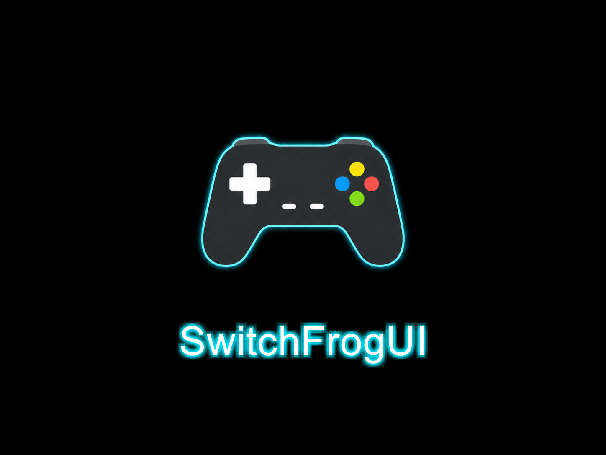
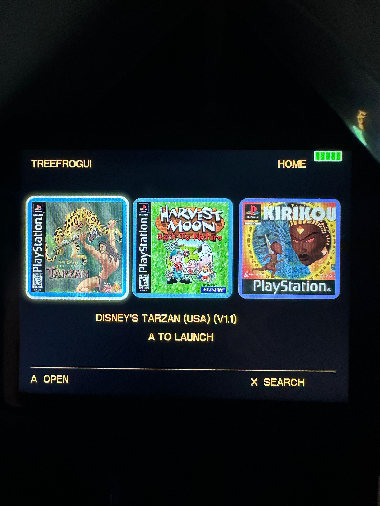
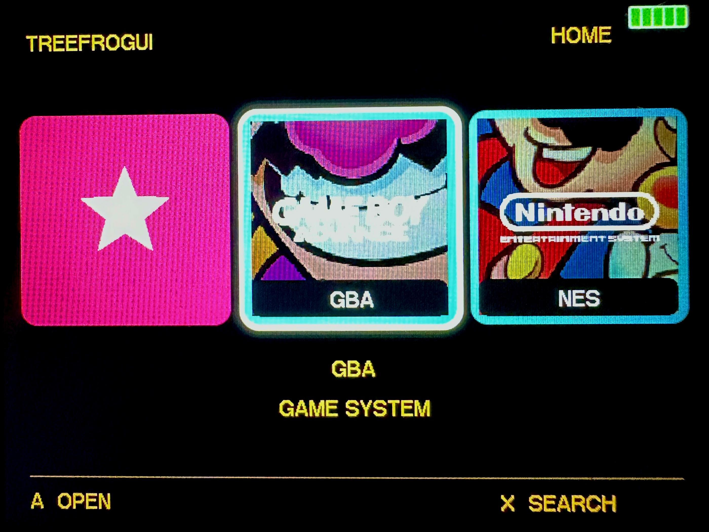
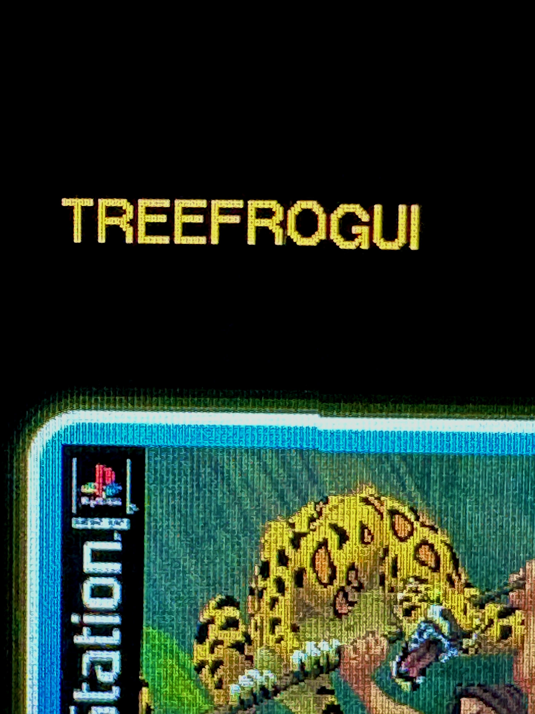
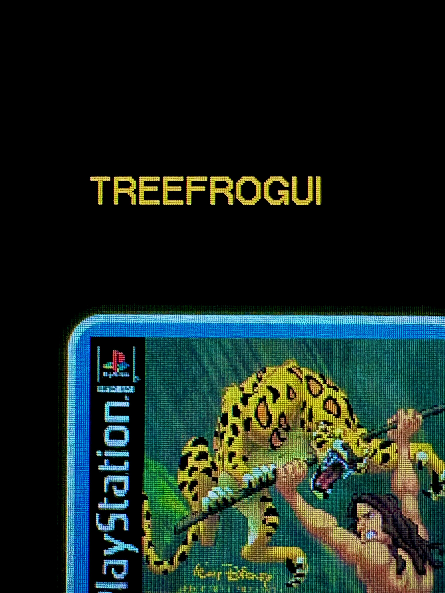

# SwitchFrogUI - R36SX Retro Frontend

<p align="center">
  
  
  
  
</p>

<p align="center">
  <a href="https://github.com/andrija95aki/SwitchFrogUi/releases/latest">Download</a>
  · <a href="README-R36SX.md">Install and build</a>
  · <a href="docs/r36sx/ADDITIONS.md">Complete additions</a>
  · <a href="docs/r36sx/SCREENSHOTS.md">Screenshots</a>
  · <a href="docs/r36sx/JSDEV.md">JSDev</a>
</p>

> **SwitchFrogUI branch:** see [README-R36SX.md](README-R36SX.md) for
> the ROM-free R36SX v2.7/H.OS 1.2 build, source instructions, media-player
> additions, hardware fixes, release documentation, and
> [annotated hardware screenshots](docs/r36sx/SCREENSHOTS.md).
> [Download the R36SX overlay](https://github.com/andrija95aki/SwitchFrogUi/releases/latest).

## What SwitchFrogUI adds

SwitchFrogUI combines TreeFrogUI's broad emulator foundation with a new
console-oriented interface, applications, R36SX hardware workarounds, and a
reproducible ROM-free distribution. Two comparisons matter because stock H.OS
and upstream TreeFrogUI start from very different feature sets.

### Added over stock R36SX H.OS 1.2

| Area | Additions |
|:--|:--|
| **Home and library** | Switch-style horizontal Home; three direct-launch last-played games; purple Recent and yellow Favourites cards; automatic platform cards; box-art grids; condensed lists; metadata category tabs; search; direct page-number jump; aligned game details with category/description; save badges; play-time records; wrap-around navigation. |
| **Emulation** | Roughly 75 emulator cores instead of the stock selection; a visible per-game emulator picker; per-core options; save states; Quick Resume; optional auto-save/auto-load; PCSX4ALL slots 1–10; corrected 48 kHz GBA buffering and conservative adaptive frameskip; improved PS1 menus, scaling, Stretch and blending; opt-in per-game PS1 FPS profiles; Doom, Heretic, Hexen, Vectrex, Odyssey 2 and many more systems. |
| **Media and documents** | Rockbox Music with card-root browsing, a Winamp-style VFD skin and FFT visualizer; hardware-decoded Videos with speed-correct audio-master pacing and conservative frame recovery; SRT/WebVTT subtitles and timing offsets; an internal Photo viewer with folder navigation, rotate, 12× zoom and pan; Ebooks; public-domain samples; whole-card Files with remembered folder cursors, automatic handlers plus a dimmed popup, multi-select, and confirmed recursive copy/cut/paste/delete, rename, and folder creation. |
| **Computer tools** | Real BusyBox terminal; keyboard-driven Text Editor; JSDev JavaScript game runtime with graphics, sound, input, animation, timers, logging and persistent data. |
| **R36SX hardware** | Display-glitch correction; persistent FN+L1+R1 rotation; reliable short-power blanking; timeout stays dark until input; black-resume repair; gradual volume curve. |
| **Input and diagnostics** | Editable keyboard-to-gamepad mapping; keyboard tester; on-screen keyboard explicitly shown or hidden with Select; hardware information; live SD/MMC, USB/OTG, input, audio, display and network diagnostics. |
| **Personalisation** | 62 themes; multi-colour gradients; theme gallery; backgrounds; 12 bundled fonts plus custom fonts; font sizing; ten icon packs; optional Art Book NextUI and Nao Black artwork packs; configurable UI sounds. |
| **Distribution** | Reproducible source branch; copy-and-boot card overlay; visible version/commit/build date; guarded SHA-256 offline updater with backups and atomic installs; rollback binaries; checksums; content audit; hardware screenshots; build/install documentation. |

### Added over the pinned TreeFrogUI/FrogUI base

| Area | SwitchFrogUI branch work |
|:--|:--|
| **New Home experience** | Horizontal console layout; last-played, utility and non-empty platform cards; artwork halo; persistent card restoration; grid/list switching; search; page-number jump; metadata-aware game detail panels. |
| **New applications** | Rockbox Music integration; H.OS hardware Videos; internal Photo viewer; whole-card Files; Terminal; Text Editor; JSDev; permanent Ebooks card and sample material. |
| **R36SX fixes** | Display correction across games/apps; global upside-down mode; power/sleep/resume fixes; perceptual volume; FAT32 discovery; optimized final-frame handling. |
| **Emulator repairs** | PS1 Start+Select, live scaling and true Stretch, transparency defaults, exit stability, duplicate cleanup, menu flicker reduction, per-game performance profiles and extra core routes. |
| **Keyboard support** | One editable 14-button mapping shared by FrogUI, PicoArch/libretro and PCSX4ALL, plus a live keyboard tester and standard editor/terminal shortcuts. |
| **Visual system** | Modern settings/sliders; theme gallery; gradients; background control; fonts and sizing; icon/sound packs; contained artwork; animation-free rendering. |
| **System visibility** | Hardware Information; Play Activity totals and most-played games; live I/O diagnostics; shareable reports; Controls & Shortcuts; scrollable About & Contributions. |
| **Engineering** | Stock-compatible H.OS video bootstrap and startup watchdog; PicoArch runtime audio recovery; hardware-assisted scaling fast paths; clean app handoff; R36SX patches; reproducible cross-build; guarded offline updates; audited ROM-free releases; rollback workflow; expanded docs. |

> [!TIP]
> **Want the exhaustive line-by-line lists?** Open
> [What SwitchFrogUI adds](docs/r36sx/ADDITIONS.md). Implementation details are
> maintained in [R36SX features and fixes](docs/r36sx/FEATURES.md).

<details>
<summary><strong>Compatible features integrated from newer TreeFrogUI 1.0.12</strong></summary>

These retain their upstream credit: ten optional platform icon packs, friendly
platform names, contained icon layouts, scroll indicators, saved-action
confirmations, GameSwitcher screenshot caching, Home-selection restoration,
and the `cubevol` volume-key fix.

</details>

## SwitchFrogUI screenshots

<table>
  <tr>
    <th width="50%">Last-played Home cards</th>
    <th width="50%">Platform artwork cards</th>
  </tr>
  <tr>
    <td></td>
    <td></td>
  </tr>
</table>

### R36SX display-glitch fix

<table>
  <tr>
    <th width="50%">Before — left 110-pixel band displaced</th>
    <th width="50%">After — persistent one-pixel correction</th>
  </tr>
  <tr>
    <td></td>
    <td></td>
  </tr>
</table>

[View all annotated hardware screenshots →](docs/r36sx/SCREENSHOTS.md)

A free, custom game-menu (frontend) for a range of MIPS-based Hichip handhelds - R36SX, SF3000, SF3500, GB350 and more (full list below). It replaces the stock menu and runs hundreds of retro systems.

**Supported devices:** R36SX (v2.6 & v2.7), **R36 HD** (and R36SX clones - see [install guide](install.md#r36sx-clones-r36hd-etc)), SF3000, SF3000 HD, SF3100, SF3500, and GB350.


> ## Support SwitchFrogUI R36SX development
> If SwitchFrogUI has been useful to you, you can support Andrija's continued
> R36SX development, device testing, and maintenance with a standard PayPal
> payment. This avoids the PayPal Donate feature, which is unavailable in
> Serbia.
>
> ### [Support SwitchFrogUI through PayPal.Me](https://paypal.me/andrijakrstic42)
> PayPal account: `andrija95aki@gmail.com`
>
> This link supports the SwitchFrogUI fork. The link below supports proszty's
> original TreeFrogUI development.

> # ☕ Consider donating to extend device support: [ko-fi.com/proszty](https://ko-fi.com/proszty)
> TreeFrogUI is free and made by one person. Every device I support, I bought with my own money. Donations are what let me buy the next handheld and add support for it (R36SX v2.7, SF3000 V3, SF3500, SF3100, GB350, HDMI clones, and more).
>
> If TreeFrogUI gave you some fun, please consider chipping in. It genuinely decides whether the next port happens.
>
> ### 👉 [**Donate here: ko-fi.com/proszty**](https://ko-fi.com/proszty) 🙏

### New here? Start with these
- 📦 **[How to install it](install.md)** - start here, step by step
- 🕹️ **[How to add games + which folder](#rom-folder-setup)** - where to put your ROMs
- 🎨 **[How to customise it](theme.md)** - themes, fonts, game art / box art / thumbnails, backgrounds
- ⬇️ **[Download the latest SwitchFrogUI R36SX overlay](https://github.com/andrija95aki/SwitchFrogUi/releases/latest)**
- 💬 **[Report a bug / give feedback](https://docs.google.com/forms/d/e/1FAIpQLSfM-y2_UnERrjScqkSfkRSEfBPJ79rDwDo3GwuYWXxpkFTp4Q/viewform?usp=header)**

> **Words you'll see (plain English):**
> - **SD card** = the little memory card your games live on.
> - **"root of the SD card"** = the **top level** of the card, **not inside any folder**. When you open the card on your PC and see folders like `cubegm`, `roms`, `frogui`, that first screen **is** the root.
> - **folder** = a directory you make on the card (e.g. `roms/GBA`). The folder **name** decides which system it runs.
> - **ROM** = a game file.
> - **BIOS** = an extra system file some consoles need to run (you supply it; see [BIOS files](#bios-files-required)).
> - **keep zips zipped** = for arcade games, do **not** unzip the `.zip`. Drop it in as-is.

---

## What's included

| Component | What it does |
|-----------|-------------|
| **TreeFrogUI** (`frogui_libretro.so`) | ROM browser and launcher, runs inside picoarch |
| **57 emulator cores** | NES, SNES, GBA, Mega Drive, PC Engine, Amiga, Atari ST, and more |
| **build system** | Cross-compile everything from source using the SF3000 toolchain |

See [cores.md](cores.md) for the full folder→core mapping table.

---

## Why TreeFrogUI?

- **Minimalistic but powerful UI** - Clean, fast game selection screen with quick navigation.
- **75 emulator cores** - Compared with only 14 in the stock OS. This includes **PICO-8** (Fake08/Retro8), **Quake** (Tyrquake), **Cave Story** (NXEngine), **Doom / Heretic / Hexen** (PrBoom), **PlayStation 1**, Vectrex, Odyssey 2/Videopac, plus classic computer systems such as Commodore Amiga and Atari ST.
- **Highly configurable cores** - Configurable settings for all cores, allowing for retro features like console palette swaps, LCD ghosting emulation, and more.
- **In-game saves** - Fully supported across all compatible cores for seamless session saving and loading.
- **Quick Resume** - Automatically boots back into the last played game upon device boot, skipping the frontend.
- **Auto-Save/Auto-Load** - Auto-saves state on pause/quit and auto-loads it on any game launch (Quick Resume boot or a manual pick from the frontend). Independent of Quick Resume - turn it on to always pick up mid-game, however you launch.
- **Clean, configurable menu** - Smooth iPhone-style background crossfades (instant selection), an optional **Hide Empty Folders** setting, and right-stick drift filtering so accidental touches don't trigger phantom presses while navigating.
- **Rich theming options** - Custom background images, fonts, and 30 built-in color themes to fit your style.
- **Game switcher** - Optional OnionOS-style recents carousel: big box art, or a screenshot of where you left off (every game is auto-screenshotted on exit), resumes the game. Turn it on in Settings (Game Switcher), it replaces the recents list.
- **Start in Recents** - Optional: boot straight into your recents (list or switcher) every time, in Settings.
- **Play-time stats** - Tracks how long you play each game, shown in the browser.
- **Ebook reader** - Read **EPUB / MOBI / PDF / CBZ / FB2** on the go (MuPDF-powered): put files in `roms/Ebook/`, adjustable text size + font (custom TTFs supported), progress saved per book. See the [ebook guide](docs/cores/ebook.md).
- **Proper PCSX4ALL support** - Configurable PlayStation 1 emulator core with native support for `.iso`, `.bin`/`.cue`, and other disc formats.
- **Flexible display scaling** - Easily adjust display scaling modes (Zoom, Aspect Ratio, and Integer Scaling) to suit your preference.

---
## ROM folder setup

**How to add games:**
1. On your PC, open the SD card. Find the **`roms`** folder (it's at the root, the top level of the card).
2. Inside `roms`, make a folder named for the system you want, exactly as in the table below. Example: for Game Boy Advance games, make `roms/GBA`.
3. Copy your game files into that folder.
4. Put the card back in, launch TreeFrogUI, and the system shows up.

The **folder name is what picks the emulator** (so `GBA` runs Game Boy Advance, `FC` runs NES, etc). Some systems accept a few different names, all listed below.

| Folder Name(s) | Target Console / System | Core Shared Library (`.so`) |
|---|---|---|
| **FC**, **nes** | NES / Famicom | `fceumm_libretro.so` |
| **NES**, **nesq** | NES / Famicom (fast) | `quicknes_libretro.so` |
| **nest** | NES / Famicom (accurate) | `nestopia_libretro.so` |
| **fds** | Famicom Disk System | `fceumm_libretro.so` |
| **SFC**, **snes** | Super Famicom / SNES | `snes9x2005_plus_libretro.so` |
| **snes02** | SNES (accurate / alt) | `snes9x2002_libretro.so` |
| **GBA**, **gba** | Game Boy Advance | `gpsp_libretro.so` |
| **mgba**, **gbaf** | Game Boy Advance (accurate) | `mgba_libretro.so` |
| **gbav** | Game Boy Advance (alt) | `vba_next_libretro.so` |
| **gb**, **dblcherrygb** | Game Boy / Color | `gambatte_libretro.so` |
| **gbgb** | Game Boy (Gearboy) | `gearboy_libretro.so` |
| **gbb** | Game Boy (TGBDual) | `tgbdual_libretro.so` |
| **MD**, **SMS**, **sega** | Mega Drive / Genesis / Master System | `picodrive_libretro.so` |
| **32x** | Sega 32X (may run slow) | `picodrive_libretro.so` |
| **GG**, **gg** | Game Gear | `gearsystem_libretro.so` |
| **gpgx** | Mega Drive (accurate) | `genesis_plus_gx_libretro.so` |
| **segacd** | Sega CD / Mega CD | `genesis_plus_gx_libretro.so` |
| **PS**, **ps1**, **psx** | PlayStation - 📖 [setup guide](docs/cores/ps1.md) | `pcsx_rearmed_libretro.so` |
| **pce** | PC Engine / TurboGrafx-16 - 📖 [notes](docs/cores/pce.md) | `mednafen_pce_fast_libretro.so` |
| **pcesgx** | PC Engine SuperGrafx | `mednafen_supergrafx_libretro.so` |
| **pcfx** | PC-FX | `mednafen_pcfx_libretro.so` |
| **pc8800** | NEC PC-8800 | `quasi88_libretro.so` |
| **ngpc** | Neo Geo Pocket / Color | `race_libretro.so` |
| **geolith** | Neo Geo AES/MVS | `geolith_libretro.so` |
| **wswan** | WonderSwan / Color | `mednafen_wswan_libretro.so` |
| **wsv** | Watara Supervision | `potator_libretro.so` |
| **vb** | Virtual Boy | `mednafen_vb_libretro.so` |
| **a26** | Atari 2600 | `stella2014_libretro.so` |
| **a5200** | Atari 5200 | `a5200_libretro.so` |
| **a78** | Atari 7800 | `prosystem_libretro.so` |
| **a800** | Atari 800 | `atari800_libretro.so` |
| **lnx** | Atari Lynx | `handy_libretro.so` |
| **atari-st** | Atari ST | `castaway_libretro.so` |
| **amiga** | Commodore Amiga - 📖 [setup guide](docs/cores/amiga.md) | `uae_libretro.so` |
| **c64** | Commodore 64 | `vice_x64_libretro.so` |
| **c64sc** | Commodore 64 (accurate) | `vice_x64sc_libretro.so` |
| **c64f**, **c64fc** | Commodore 64 (Frodo) | `frodo_libretro.so` |
| **vic20** | Commodore VIC-20 | `vice_xvic_libretro.so` |
| **msx** | MSX | `bluemsx_libretro.so` |
| **spec** | ZX Spectrum | `fuse_libretro.so` |
| **zx81** | ZX81 | `81_libretro.so` |
| **col** | ColecoVision | `gearcoleco_libretro.so` |
| **amstrad** | Amstrad CPC | `crocods_libretro.so` |
| **amstradb** | Amstrad CPC (CPC+) | `cap32_libretro.so` |
| **thom** | Thomson MO/TO | `theodore_libretro.so` |
| **xmil** | Sharp X68000 | `x68k_libretro.so` |
| **pico286** | DOS / PC (8086-286, standalone) - 📖 [setup guide](docs/cores/pico286.md) | `pico286` + `x86BOOT.img` |
| **Quake** | Quake | `tyrquake_libretro.so` |
| **quake2** | Quake II (heavy) - 📖 [setup guide](docs/cores/quake2.md) | `vitaquake2_libretro.so` |
| **prboom** | Doom / Doom II / Final Doom / Heretic / Hexen | `prboom_libretro.so` |
| **wolf3d** | Wolfenstein 3D - 📖 [setup guide](docs/cores/wolf3d.md) | `ecwolf_libretro.so` |
| **outrun** | Out Run | `cannonball_libretro.so` |
| **cavestory** | Cave Story | `nxengine_libretro.so` |
| **flashback** | Flashback | `reminiscence_libretro.so` |
| **xrick** | Rick Dangerous | `xrick_libretro.so` |
| **jnb** | Jump 'n Bump | `jumpnbump_libretro.so` |
| **gw** | Game & Watch | `gw_libretro.so` |
| **pico8** | PICO-8 (fake08) - also accepts legacy `fake08` folder | `fake08_libretro.so` |
| **retro8** | PICO-8 (retro8) | `retro8_libretro.so` |
| **lowres-nx** | LowRes NX | `lowresnx_libretro.so` |
| **tic80** | TIC-80 fantasy console | `tic80_libretro.so` |
| **pokem** | Pokémon Mini | `pokemini_libretro.so` |
| **m2k** | MAME 2000 (MAME 0.37b5 romset) | `mame2000_libretro.so` |
| **cps1** | Capcom CPS-1 arcade | `fbalpha2012_cps1_libretro.so` |
| **cps2** | Capcom CPS-2 arcade | `fbalpha2012_cps2_libretro.so` |
| **cps3** | Capcom CPS-3 arcade (experimental, slow) | `fbalpha2012_cps3_libretro.so` |
| **neogeo** | Neo Geo arcade | `fbalpha2012_neogeo_libretro.so` |
| **int** | Mattel Intellivision | `freeintv_libretro.so` |
| **fcf** | Fairchild Channel F | `freechaf_libretro.so` |
| **cdg** | CD+G Karaoke | `pocketcdg_libretro.so` |
| **chip8** | CHIP-8 | `jaxe_libretro.so` |
| **arduboy** | Arduboy (Ardens - fast) | `ardens_libretro.so` |
| **arduous** | Arduboy (arduous/simavr - cycle-accurate, slower) | `arduous_libretro.so` |
| **vec** | Vectrex | `vecx_libretro.so` |
| **o2em** | Odyssey² / Videopac | `o2em_libretro.so` |
| **gme** | Game Music Emu | `gme_libretro.so` |
| **gong** | Pong clone | `gong_libretro.so` |
| **vapor** | VaporSpec | `vaporspec_libretro.so` |
| **rockbox** | Music player (MP3/FLAC/OGG…, standalone) - 📖 [setup guide](docs/cores/rockbox.md) | `rockbox` |

See [cores.md](cores.md) for detailed build status and source repositories of TreeFrogUI external cores.

**PICO-8 (fake08):** place carts in `roms/pico8/` (the legacy `roms/fake08/` folder still works). Both `.p8` (text source) and `.p8.png` (cart image) formats are supported.

**Arduboy:** the `arduboy` folder uses the **Ardens** core (a fast custom AVR emulator) and accepts both `.hex` and `.arduboy` files. The `arduous` folder runs the older simavr-based **arduous** core (cycle-accurate but much slower; `.hex` only) - use it only if a game misbehaves under Ardens.

### Systems that need extra setup

A few systems need more than "drop the ROM in the folder" - either extra companion files or a bit of one-time setup. Full instructions live in their own guide:

| System | What's different | Guide |
|---|---|---|
| Arcade (`cps1`/`cps2`/`neogeo`/`m2k`) | Romsets are version-locked per core, Neo Geo needs a BIOS | 📖 [docs/cores/arcade.md](docs/cores/arcade.md) |
| DOS / PC (`pico286`) | Needs FreeDOS (bundled), floppy vs hard-disk images | 📖 [docs/cores/pico286.md](docs/cores/pico286.md) |
| Rockbox music player (`rockbox`) | Standalone app, themes | 📖 [docs/cores/rockbox.md](docs/cores/rockbox.md) |
| Commodore Amiga (`amiga`) | Needs your own Kickstart ROM | 📖 [docs/cores/amiga.md](docs/cores/amiga.md) |
| Wolfenstein 3D (`wolf3d`) | Needs the game data **and** the engine's own resource pack | 📖 [docs/cores/wolf3d.md](docs/cores/wolf3d.md) |
| Quake II (`quake2`) | Game data goes in a required `baseq2/` subfolder | 📖 [docs/cores/quake2.md](docs/cores/quake2.md) |
| PlayStation 1 (`PS`/`ps1`/`psx`/`ps1r`) | Two cores, BIOS strongly recommended | 📖 [docs/cores/ps1.md](docs/cores/ps1.md) |

---

## Customisation (themes, fonts, game art / box art / thumbnails, backgrounds)

Make it look how you want. Full step-by-step in the 📦 **[Customisation Guide](theme.md)**. The quick version:

**Theme (colors)** - in TreeFrogUI: Settings → Theme, press Left/Right. 30 built-in color themes. (The in-game emulator menu picks up the same theme colors automatically.)

**Font** - Settings → Font, press Left/Right. Or drop a `.ttf`/`.otf` in `frogui/fonts/` and pick it. The default is **BPreplayBold** (the bold font used by MinUI/NextUI).

**Wallpaper** (one image for every screen) - Settings → Appearance → **Wallpaper**. Drop images in **`frogui/wallpapers/`** (`.png`/`.jpg`/`.bmp`) and pick one; it replaces the per-system art everywhere. **Wallpaper Fit** sets how it's placed: **Fill** (cover, cropped), **Fit** (letterboxed), **Stretch**, **Center**, or **Tile**. Choose **None** to go back to per-system backgrounds.

**Hide extensions / backgrounds** - Settings → Appearance: **Hide Extensions** drops the `.gb`/`.gba` from names; **Background Images** off gives a plain themed background.

**Game art / box art / cover / thumbnail** (the picture shown for each game) - drop a **PNG / JPG / BMP** in a hidden `.res/` folder next to the ROM, named after the ROM:
```
roms/GBA/Advance Wars.gba
roms/GBA/.res/Advance Wars.png    ← the box art
```
No conversion needed - use **PNG or JPG**, any resolution, big images are downscaled automatically (max shown size 250×200), and PNG transparency is supported. Rule: `<rom folder>/.res/<rom name without extension>.png` (or `.jpg`). Old raw `.rgb565` thumbnail sets still work - see [theme.md](theme.md#game-thumbnails).

**Background image** (per system / screen) - drop a `854×480` `.png`/`.jpg`/`.bmp` in **`frogui/`**, named after the screen or folder:
```
frogui/main.png          ← main systems list
frogui/recents.png       ← recent games
frogui/favourites.png    ← favorites
frogui/FC.png            ← the FC (NES) folder (name must match the roms folder)
```
Use dark/muted images so menu text stays readable.

See the [Customisation Guide](theme.md) for exact sizes, naming, theme list, and fonts.

---

## Shortcuts

While playing a game, **SELECT** is the function key (like the MENU button on other handhelds). Hotkeys follow the OnionOS layout:

- **`SELECT + START`** - open the in-game menu.
- **`SELECT + R2`** - save state.
- **`SELECT + L2`** - load state.
- **`SELECT + R1`** - fast-forward: off, 2x, 3x, off (audio mutes). Off by default, turn it on per core in the menu (Audio and video).
- **`SELECT + B`** - hold to rewind. Off by default, turn it on per core in the menu (it uses RAM and slows the game).
- **`SELECT + L1`** - screenshot: grabs the current frame (game, menu, anything on screen) to a `.bmp` in the `screenshots/` folder on your card.

> Fast-forward and rewind are now **per-core toggles** (menu, Audio and video). They stay off until you enable them, so cores that don't need them keep full RAM and speed.

PCSX4ALL (PS1) is a standalone emulator with its own menu and hotkeys.

---

## BIOS files required

Some cores need BIOS/firmware files. Place them in the system folder the core expects (check individual core docs), typically alongside the ROMs or in a `bios/` subfolder. PS1, Amiga, and Wolfenstein 3D have more involved setup - see their guides in the [table above](#systems-that-need-extra-setup).

| System | File needed |
|--------|-------------|
| PlayStation 1 | any PS1 BIOS (`scph*.bin`) in **`cubegm/bios/`** - auto-detected, no exact name needed. 📖 [full guide](docs/cores/ps1.md), **strongly recommended** |
| GBA (gpsp) | `gba_bios.bin` (official Nintendo GBA BIOS) |
| Amiga (UAE) | Kickstart ROM - 📖 [full guide](docs/cores/amiga.md) |
| Atari ST (castaway) | TOS ROM image |
| Wolfenstein 3D (ecwolf) | Game data + `ecwolf.pk3` - 📖 [full guide](docs/cores/wolf3d.md) |
| Famicom Disk System (fds) | `disksys.rom` in **`cubegm/bios/`** |
| Neo Geo (geolith / neogeo) | `neogeo.zip` BIOS in **`cubegm/bios/`** |
| Sega CD / Mega CD (segacd) | `bios_CD_U.bin` / `bios_CD_E.bin` / `bios_CD_J.bin` (region BIOS) in **`cubegm/bios/`** |
| PC-FX (beetle-pcfx) | `pcfx.rom` |
| PC-88 (quasi88) | NEC PC-88 BIOS files |

---

## Troubleshooting & logs

TreeFrogUI keeps **logging off by default** so it doesn't wear out your SD card. If something misbehaves and you want to capture what happened (or a maintainer asks for a log), turn logging on:

1. Power off and take the SD card out, put it in your PC.
2. At the **root of the card** (same level as `cubegm`, `roms`, `frogui`), create an **empty file named `log.txt`**.
   - Windows: right-click → New → Text Document, name it exactly `log.txt` (make sure it's not `log.txt.txt`).
   - Mac/Linux: `touch log.txt` at the card root.
3. Put the card back, boot, and reproduce the problem.
4. Power off, bring the card back to your PC, and read/share **`/log.txt`** (the previous boot is kept as `log.txt.prev`).

The log records the boot sequence, which device was detected, the display path (`use_hw=1` hardware / `use_hw=0` software), and any crashes with their exit codes.

**To turn logging back off:** just delete `log.txt` from the card. No file = no logging = no extra SD writes.

> If you never create `log.txt`, nothing is written and there's zero logging overhead, which is how the release ships.

---

## Building from source

### Requirements

- **SF3000 cross-toolchain** (MIPS32r2, little-endian, hard-float) extracted to
  `~/sf3000-work/sf3000toolchain/`. Download it here:
  **[game-de-it/sf3000 · sf3000_toolchain_v0.1](https://github.com/game-de-it/sf3000/releases/tag/sf3000_toolchain_v0.1)**
  The build scripts expect
  `~/sf3000-work/sf3000toolchain/mipsel-buildroot-linux-gnu_sdk-buildroot/opt/ext-toolchain/bin/mips-mti-linux-gnu-*`.
- `git`, `make`, `nproc`
- `cmake` (only for the cmake-based cores: TIC-80; a static build from
  [Kitware](https://github.com/Kitware/CMake/releases) works, no root needed).
  `build_all.sh` skips those cores with a warning if cmake is absent.

### Steps

```sh
# Workspace root holds all the source repos as siblings
mkdir -p ~/sf3000-work && cd ~/sf3000-work

# Main repo (build scripts, patches, staging, docs)
git clone git@github.com:tzubertowski/treefrog-ui.git sf3000_treefrogui

# Frontend + standalone emulator sources (separate repos, built in place)
git clone -b r36sx git@github.com:tzubertowski/FrogUI.git FrogUI
git clone -b r36sx git@github.com:tzubertowski/TreeFrogUI_picoarch.git picoarch
git clone        git@github.com:tzubertowski/TreeFrogUI_pcsx4all.git pcsx4all
git -C picoarch submodule update --init libretro-common   # libpicofe is vendored

cd sf3000_treefrogui
./clone_cores.sh      # clones all libretro core upstreams into cores/
./build_all.sh        # applies patches/, builds cores + pico286 + TIC-80 (needs cmake)

# .so cores land in build/ ; pico286/pcsx4all binaries go to staging cubegm/
cp build/*.so /mnt/sdcard/cubegm/cores/
```

Repos: **treefrog-ui** (this), **FrogUI** (launcher core), **TreeFrogUI_picoarch**
(libretro frontend, our fork), **TreeFrogUI_pcsx4all** (standalone PS1). pico286
is reconstructed from `patches/pico286-sf3000.patch` onto the upstream `xrip/pico-286`
clone, so it needs no separate repo. BIOS, romsets, and the FreeDOS `x86BOOT.img`
are user-supplied (see the BIOS section).

### Build FrogUI only

```sh
cd frogui
make -f Makefile.sf3000 frogui_libretro.so
cp frogui_libretro.so /mnt/sdcard/cubegm/cores/
```

---

## How it works

The stock boot is never touched or replaced. Instead TreeFrogUI hooks the stock
menu's own autorun feature to launch itself:

```
[boot] stock rkgame (verified, untouched)
    │
    └─► autorun → our hijacked core forks cubegm/zhijack.sh
                       │
                       └─► picoarch frogui_libretro.so   ← TreeFrogUI is a libretro core
                                 │
                                 │  user selects ROM
                                 │
                                 └─► fork()
                                        │
                                   [parent]            [child]
                                   waitpid()           picoarch <game_core.so> <rom>
                                   (blocks)                │
                                      │              game runs
                                      │              user exits
                                      │                  │
                                   resumes ◄──── child exits
                                   TreeFrogUI menu
```

This "hijack" approach exists because newer devices (SF3500-class) verify
`icube` and `rkgame` at boot - replacing those files outright shows a "sdcard is
damaged" error. Hooking the autorun instead works on every supported device.

**picoarch** handles display (`/dev/dis` + framebuffer), audio (ALSA), and the libretro core lifecycle. TreeFrogUI is just another `.so` loaded by picoarch - it renders the file browser UI and uses `fork+waitpid` to launch games without losing the display connection.

**Input** comes from `cubevol` (SF3000 button daemon) via shared memory at `/tmp/joy_key`. TreeFrogUI reads it directly since picoarch doesn't route input callbacks to cores on this device.

---

## Repository structure

```
treefrog-ui/
├── frogui/          ← FrogUI source (git submodule, sf3000 branch)
├── cores/           ← emulator core sources (populated by clone_cores.sh)
├── build/           ← compiled .so output (gitignored)
├── patches/         ← patches applied to externally-owned core repos at build time
├── build_all.sh     ← build all cores
├── clone_cores.sh   ← clone all core source repos
└── cores.md         ← folder→core mapping reference
```

---

## What's not included / known limitations

| Item | Status |
|------|--------|
| `vecx` (Vectrex) | ✅ official software-rendered v1.0.12 core included |
| `ardens` (Arduboy, default) | ✅ built directly (no cmake); C++14 libretro target |
| `arduous` (Arduboy, alt) | ✅ simavr-based, built directly (cycle-accurate, slow) |
| `o2em` (Odyssey² / Videopac) | ✅ official v1.0.12 core included |
| `vice` (C64) | commented out - large build, enable manually in build_all.sh |
| picoarch binary | not included - obtain from SF3000 multicore project |

---

## Device notes

### R36SX

> [!NOTE]
> **Right analog stick.** The right stick **cannot** work as a real analog stick, and no software update can change that. On this console it's physically wired to act **exactly like the X / A / B / Y face buttons**: nudging it is the same as pressing those buttons, just on/off, with no "how far" or "which angle" info. The console never hands analog data to apps like TreeFrogUI. So the right stick simply **mirrors the face buttons** (tiny accidental movements are ignored, so it won't fire on its own). Hardware limitation, not a bug or missing feature.

> [!NOTE]
> **TreeFrogUI gives you true hibernation instead of sleep.** Turn on **Quick Resume** (Settings → Quick Resume) with **Auto-Save/Auto-Load** and the device boots straight back into your game at the exact moment you left off - pick up mid-race, mid-battle, anywhere. It survives a full power-off, so it's better than sleep: zero battery drain while it's off. Stock power-button sleep/standby itself is **not supported and won't be** (it can hang the display on wake on R36SX and SF3500-class devices), so **Disable Sleep is on by default** - you're not missing anything, hibernation covers the "put it down, pick it back up" use case completely.

### SF3000 family

> [!NOTE]
> One package now supports **six devices**, auto-detected at boot from the device
> tree: **R36SX** (v2.6 / v2.7), **SF3000**, **SF3000 HD**, **SF3100**, **SF3500**,
> and **GB350**. SF3000 HD, SF3100 and SF3500 share the same 854×480 panel + driver
> (HD/SF3100 report as "SF3500" in the log, expected). GB350 is a 640×480 4:3
> device. See the [install guide](install.md) for the per-device stock backup and
> the matching `install_first/<device>/` folder.

---

## Porting TreeFrogUI to other devices

Want TreeFrogUI on a device that isn't supported yet? SF3000 V3 (bootloader
protection), the **SF3000 Pro** (different firmware entirely, no rkgame stack, so
the autorun hijack doesn't apply), other HDMI-out clones, and more are on the
wishlist.

The catch: porting needs the actual hardware in hand. Bootloaders differ, input
and display wiring differ, the protected variants need live debugging. There's
no way to do it blind.

Every device supported so far was bought out of my own pocket. There are far
more clones out there than I can reasonably keep buying.

If you want to see a port happen, chip in: **https://ko-fi.com/proszty**.
Donations go straight toward buying the next device to port to.

---

## Credits

- **picoarch** - libretro frontend adapted for SF3000
- **FrogUI** - original launcher by tzubertowski, fork of [FrogUI](https://github.com/tzubertowski/FrogUI)
- **angree** - Amiga (UAE4ALL) and Atari ST (castaway) ports for SF-series handhelds
- **goph-R** - [SF3000-RE](https://github.com/goph-R/SF3000-RE) reverse engineering project and boot logo specs
- **SjslTech** - [YouTube](https://www.youtube.com/@SjslTech) - R36SX testing & contributions
- All libretro core authors

---

## License & Attribution

This project is a compilation of multiple components, each retaining its original license:

- **TreeFrogUI for SF3000 (UI Port)**: Licensed under the **Creative Commons Attribution-NonCommercial-ShareAlike 4.0 International (CC BY-NC-SA 4.0)** license. It is a heavily modified fork of [FrogUI](https://github.com/tzubertowski/frogui), created by Tomasz Zubertowski, Desoxyn, and Q_ta.
 - *Attribution*: Changes have been made to support the SF3000 hardware architecture, resolution, input handling, and directory layout.
 - *ShareAlike*: Any modifications or derivations of the UI frontend code must be distributed under the same CC BY-NC-SA 4.0 license.
 - *NonCommercial*: This software is strictly for non-commercial use. Selling or bundling it with commercial devices is prohibited.
  - *Assets & Images*: The logo and original UI font were taken from the upstream [FrogUI](https://github.com/tzubertowski/frogui) repository, while the default system background images were sourced from the **[Art Book Next](https://github.com/anthonycaccese/art-book-next-es)** ES-DE theme by Anthony Caccese. These assets are used under their respective open-source and creative commons licenses.
  - *Default UI font*: **BPreplay** (BPreplayBold) by **George Triantafyllakos / [Backpacker](https://www.fontsquirrel.com/fonts/bpreplay)**, used under its free license (same font used by MinUI / NextUI). Bundled in `frogui/fonts/`; selectable/replaceable in Settings → Font.
- **picoarch (Frontend Integration)**: Uses code from `libpicofe` (triple-licensed under GNU GPL v2+, GNU LGPL v2.1+, or the MAME license) and neonloop's wrapper code (licensed under the **BSD 3-Clause License**).
- **Emulator Cores**: Each emulator core located in the `cores/` directory is built from its respective upstream repository and retains its individual open-source license (such as GPL, BSD, MIT, or MAME license). See [cores.md](cores.md) and individual core subdirectories for details.

See the root [LICENSE.md](LICENSE.md) file for the full copyright notices and license texts.
