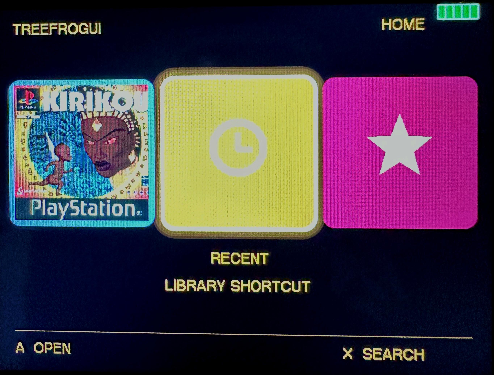
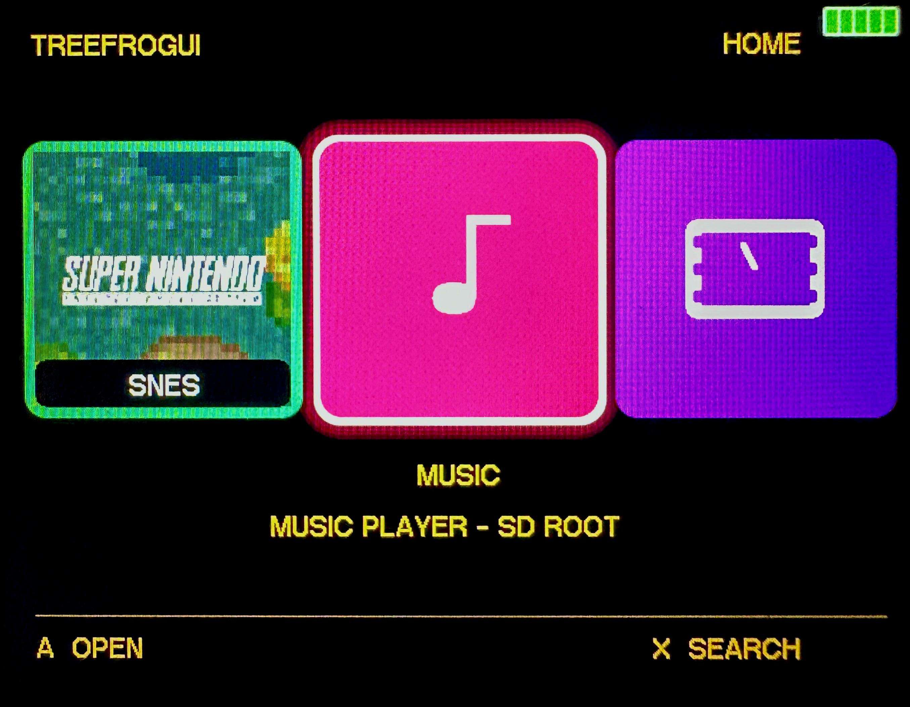
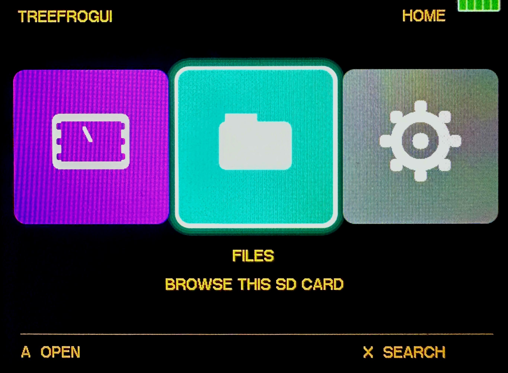
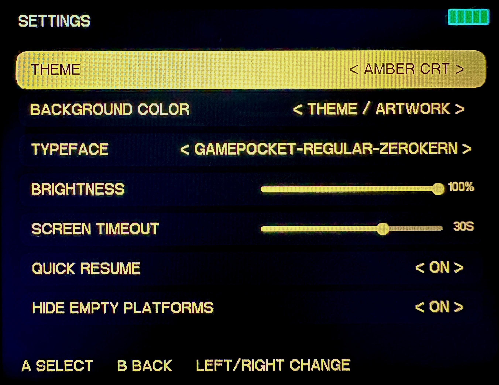
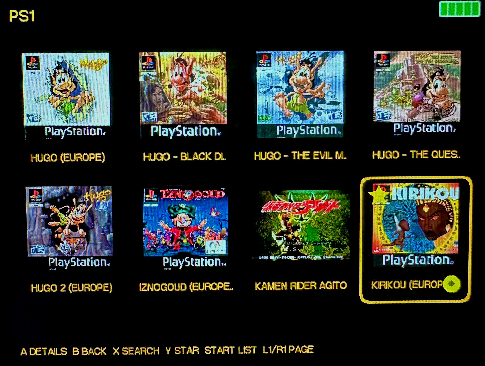
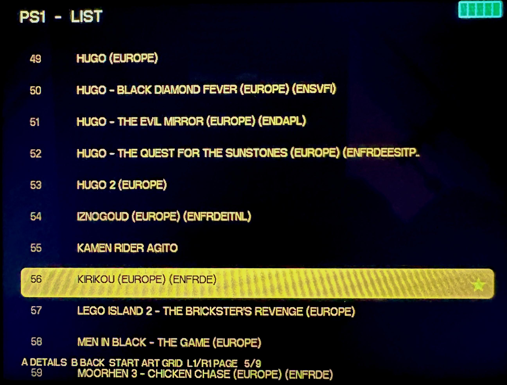
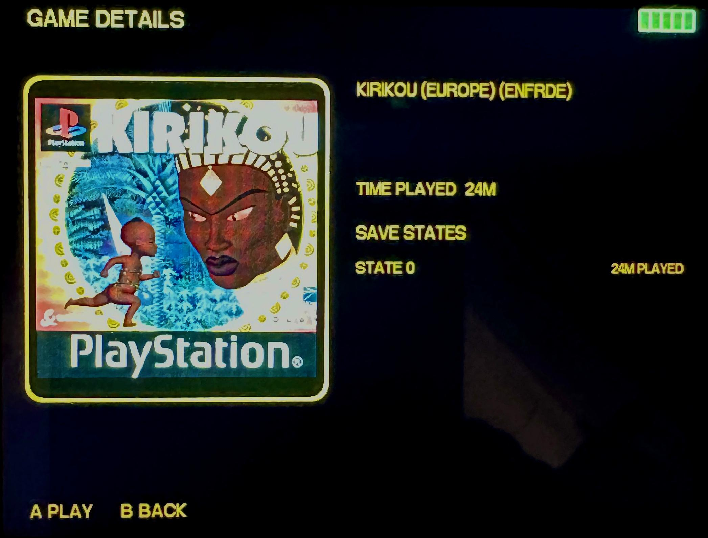
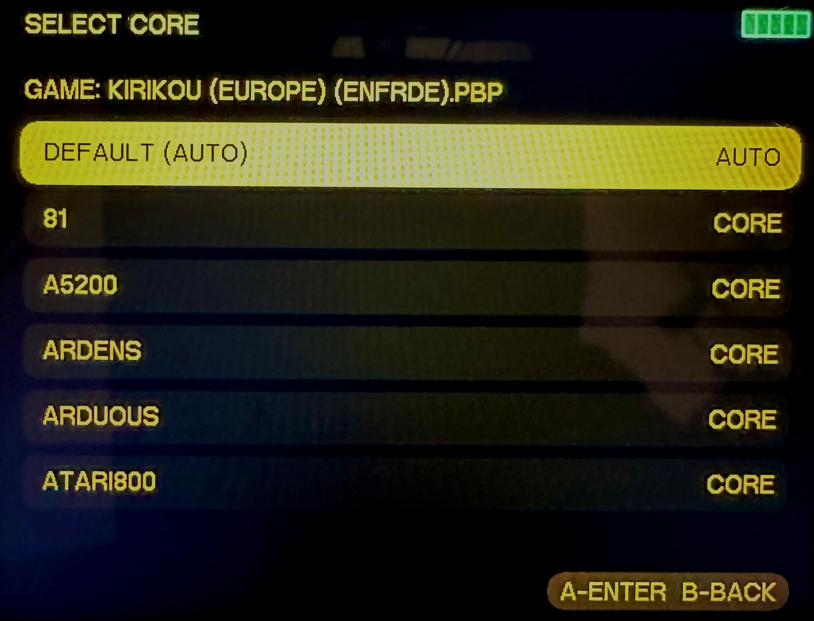
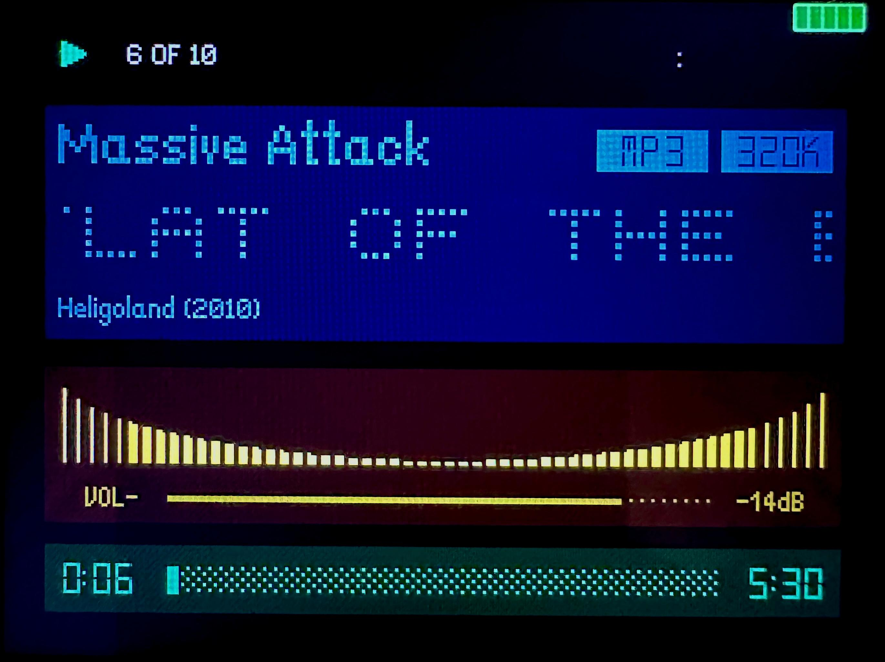

# R36SX hardware screenshots

These are photographs of the current SwitchFrogUI build running on
an R36SX v2.7 motherboard with H.OS 1.2. Camera exposure and the LCD pixel grid
can make colours look brighter than they appear in person.

## R36SX display-glitch correction

The comparison is intentionally shown at equal size. The affected hardware
shifts the left 110-pixel display band vertically, producing a visible break in
horizontal edges. The persistent setting applies a one-pixel compensation to
that band in SwitchFrogUI, games, emulator menus, Rockbox, and standalone apps.

<table>
  <tr>
    <th width="50%">Before — correction disabled</th>
    <th width="50%">After — correction enabled</th>
  </tr>
  <tr>
    <td></td>
    <td></td>
  </tr>
  <tr>
    <td>The upper-left card edge exposes the displaced left display band.</td>
    <td>The one-pixel correction realigns the edge while preserving the full 640×480 frame.</td>
  </tr>
</table>

## Home screen

<table>
  <tr>
    <th width="50%">Last-played games</th>
    <th width="50%">Recent and Favourites</th>
  </tr>
  <tr>
    <td></td>
    <td></td>
  </tr>
  <tr>
    <td>The first three Home cards launch the most recently played games directly.</td>
    <td>Dedicated Recent and Favourites collections remain available as library shortcuts.</td>
  </tr>
  <tr>
    <th>Platform cards</th>
    <th>Music and Videos</th>
  </tr>
  <tr>
    <td></td>
    <td></td>
  </tr>
  <tr>
    <td>Only platforms containing at least one detected game are shown.</td>
    <td>Music opens Rockbox at the SD-card root; Videos is the neighbouring media app.</td>
  </tr>
  <tr>
    <th>Videos, Files, and Settings</th>
    <th>Modern Settings menu</th>
  </tr>
  <tr>
    <td></td>
    <td></td>
  </tr>
  <tr>
    <td>Dedicated media browser, whole-card file browser, and cog-wheel Settings card.</td>
    <td>Theme/background controls and sliders for brightness and screen timeout.</td>
  </tr>
</table>

## Game libraries

<table>
  <tr>
    <th width="50%">Artwork grid</th>
    <th width="50%">Condensed list</th>
  </tr>
  <tr>
    <td></td>
    <td></td>
  </tr>
  <tr>
    <td>Box-art cards show a top-left favourite star and bottom-right save-data badge.</td>
    <td>START switches to a fast 12-row list; L1/R1 changes pages in large collections.</td>
  </tr>
  <tr>
    <th>Game details</th>
    <th>Per-game core selector</th>
  </tr>
  <tr>
    <td></td>
    <td></td>
  </tr>
  <tr>
    <td>Full title, artwork, total play time, and playtime associated with each detected save state.</td>
    <td>Optional core overrides leave the tested automatic platform mapping as the default.</td>
  </tr>
</table>

## Rockbox music player

  

Rockbox provides card-root music browsing, album/track information, a spectrum
display, gradual volume control, and the R36SX-friendly A-confirm/B-back keymap.
